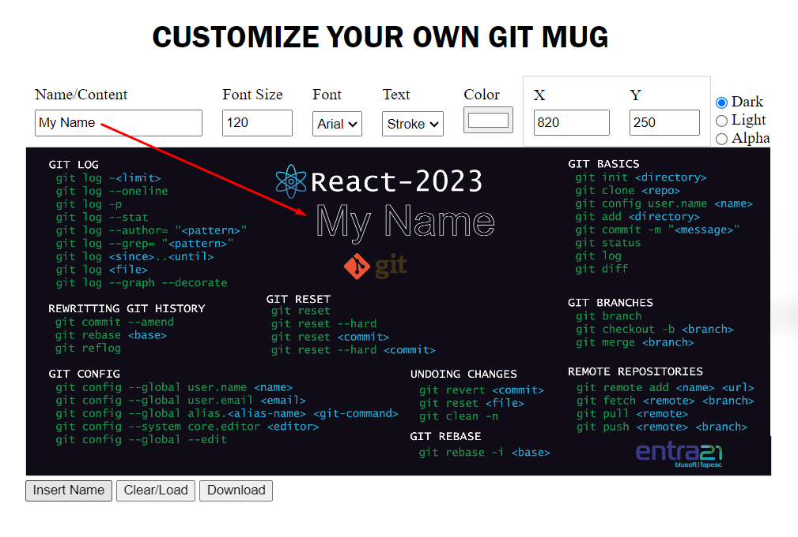
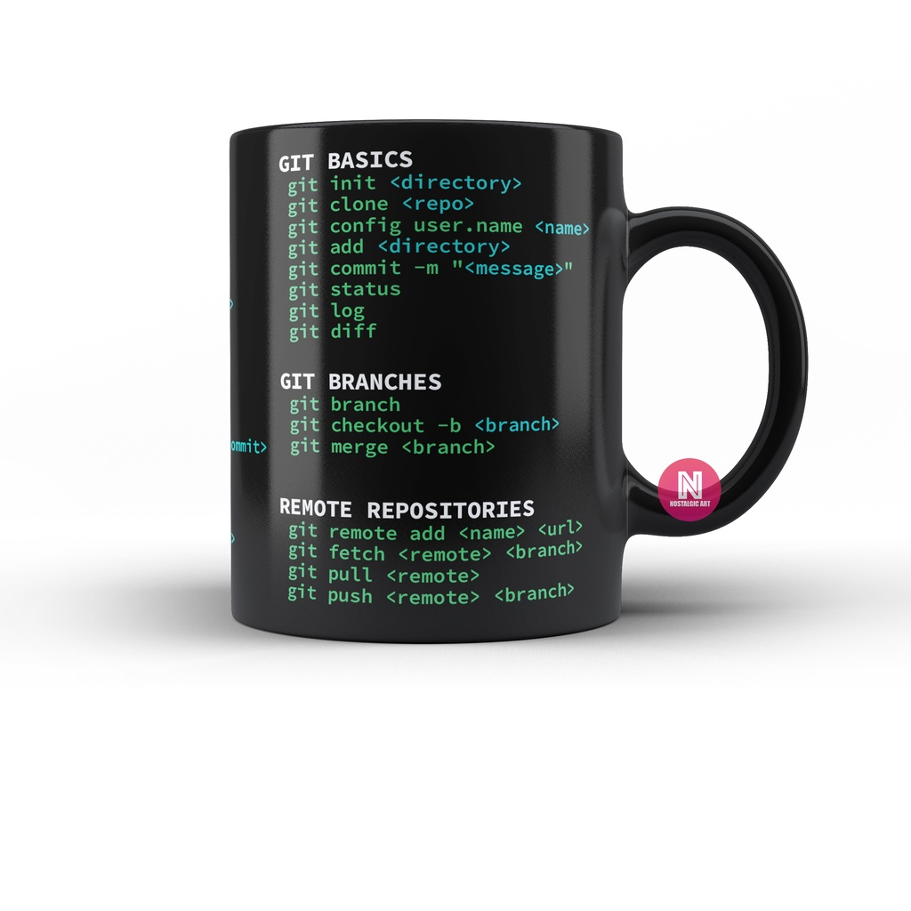

[English](./readme.md) | Português | [German](./readme-de_DE.md)

---

# Layout Editor for Sublimation Mugs 

Dies ist ein didaktisches Projekt, das für HTML-, CSS- und JavaScript-Kurse entwickelt wurde. Die Anwendung ermöglicht das Laden eines vordefinierten Hintergrundbilds in ein HTML-Canvas-Element.
Dem Bild können ein oder mehrere benutzerdefinierte Texte hinzugefügt werden. Nachdem Sie die Bearbeitung abgeschlossen haben, laden Sie einfach das individuelle Bild herunter, das dann für die Sublimation von Tassen verwendet werden kann.

 

## Ausführen der Anwendung

Um das Projekt lokal auszuführen, öffnen Sie einfach die Datei index.html in einem Webbrowser.

Optional können Sie das Projekt ausführen, indem Sie auf die folgende Adresse zugreifen:

    https://ivan-j-borchardt.github.io/Project_Layout_Editor_for_Sublimation_Mugs/

Senden Sie das Kunstwerk an eine Druckerei, um Ihre individuelle Tasse anzufertigen ...

### Technologien

- HTML 5
- CSS 3 
- JavaScript

### Autor
Ivan J. Borchardt

 

### Lizenz
Dieses Projekt steht unter der MIT-Lizenz.
