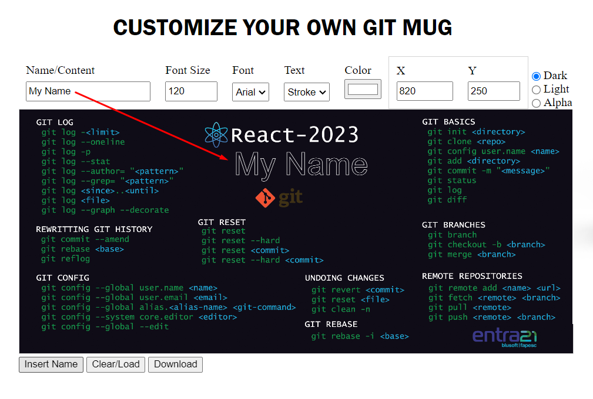

English | [Português](./README-pt_BR.md) | [German](./README-de_DE.md)

---

# Layout Editor for Sublimation Mugs 

This is a didactic project developed for HTML, CSS and JavaScript classes. The application allows loading a predefined background image in an Html Canvas element.
One or more custom texts can be added to the image. After finishing editing, just download the customized image that can then be used for sublimation of mugs.

## Running the Application

To run the project locally, simply open the index.html file in a web browser.  

Optionally you can run the project by accessing the address below:

    https://ivan-j-borchardt.github.io/Project_Layout_Editor_for_Sublimation_Mugs/

Send the artwork to a Print Bureau to make your custom mug... 

### Technology

- HTML 5
- CSS 3 
- JavaScript

### Author
Ivan J. Borchardt

 

### License
This project is under the MIT license.
